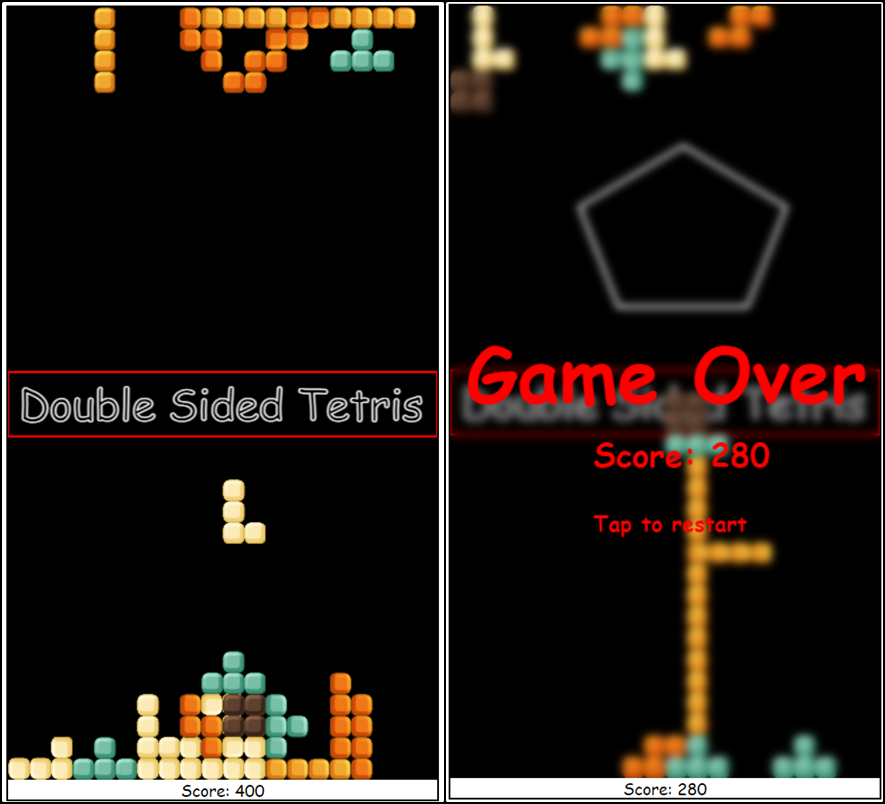

<h1 align="center">
 <strong>Double Sided Tetris</strong>
 
</h1>

## Table of contents
* [Commits info](#cinfo)
* [Introduction](#introduction)
* [Features](#features)
* [Screenshots](#screenshots)
* [Technologies](#technologies)
* [License](#license)

## Commits info
Due to fact, that this project was made quickly just for passing "Mobile Game Development" at university, commits are not kind of "good" in terms of naming, and commit frequency. <b> For my git commiting style, please see other projects </b>

## Introduction
Double Sided Tetris is Web, Android, and iOS tetris game, which has got two tetris games inside - sometimes blocks go upward, sometimes downwards.
This application is made with JavaScript, and Cordova (which allows this app to be multiplatform).
Tetris looks easy to write, but to be honest, this was a lot of work - all logic (collisions etc.) is made by mathematic operations at matrixes.

## Features
* Play tetris, in which blocks go up and down
* Invert steering according to blocks direction
* Rotate and move blocks
* Blocks line disappear after filling it
* Save highscore to online database
* Play at Android/iOS mobile device, or in web browser

## Screenshots

 

## Technologies
* Plain JavaScript
* Cordova (which adds a lot of files to the project as You can see)
* Firebase database

Application tested on Android 7.1, 8.0, 9.0, Windows 10 with Chrome

## License
GNU General Public License v3.0
